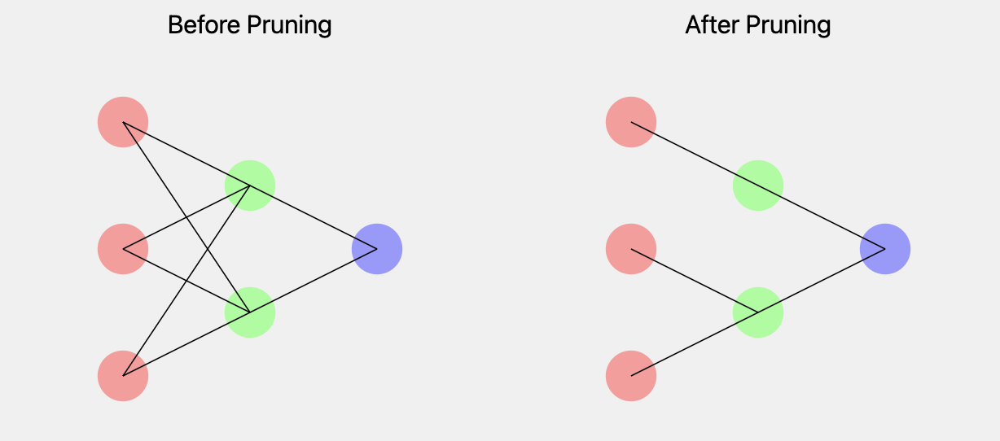

# AI Compilers: Optimizing AI Workloads for Modern Hardware

In our first blog, we embarked on an exciting exploration of the world of AI compilers, where the intricate dance of model optimization meets the evolving demands of modern hardware. As we delve deeper into this captivating domain, we will uncover how AI compilers not only enhance the performance of AI workloads but also empower developers and researchers to harness the full potential of the hardware at their disposal. Whether you're working with powerful GPUs or limited-edge devices like Raspberry Pi, understanding these concepts is crucial for optimizing your AI models.

## The Role of AI Compilers in Optimization

AI compilers serve as the bridge between high-level machine learning frameworks and low-level hardware execution. They optimize the process of translating complex models into efficient machine code that can run seamlessly on various hardware platforms. The significance of AI compilers in optimizing AI workloads cannot be overstated, particularly in today's landscape where computational resources can be limited. Here are some fundamental optimization techniques employed by AI compilers:

1. **Graph Optimization**: AI compilers analyze the computational graph—a representation of the operations and data flow within a model—to identify inefficiencies and redundancies. By fusing operations and eliminating unnecessary computations, they minimize memory access and maximize throughput. This leads to faster execution times and reduced resource consumption.

### Example: TensorFlow Graph Optimization

Consider the following TensorFlow code:

```python
import tensorflow as tf

@tf.function
def simple_model(x):
    y = tf.add(x, 1)
    z = tf.multiply(y, 2)
    return z

x = tf.constant([[1.0, 2.0], [3.0, 4.0]])
result = simple_model(x)
print(tf.autograph.to_code(simple_model.python_function))
```

TensorFlow's `@tf.function` decorator automatically optimizes this graph.

2. **Quantization**: One of the most effective techniques for improving model efficiency is quantization, which involves reducing the precision of the numerical values in the model. By converting weights and activations from 32-bit floating-point numbers to lower-precision formats, such as 16-bit or even 8-bit integers, compilers can significantly reduce the memory footprint and enhance inference speed. This is particularly valuable for deploying models on mobile devices and edge hardware, where every byte counts.

### Example: TensorFlow Lite Quantization

Here's an example of how to quantize a TensorFlow model using TensorFlow Lite:

```python
import tensorflow as tf

# Create a simple model
model = tf.keras.Sequential([
    tf.keras.layers.Dense(4, input_shape=(4,), activation='relu'),
    tf.keras.layers.Dense(2, activation='softmax')
])

# Convert to TensorFlow Lite model
converter = tf.lite.TFLiteConverter.from_keras_model(model)
converter.optimizations = [tf.lite.Optimize.DEFAULT]
quantized_tflite_model = converter.convert()

# Save the quantized model
with open('quantized_model.tflite', 'wb') as f:
    f.write(quantized_tflite_model)
```

Let's visualize the effect of quantization on model size and accuracy:

                 

This chart illustrates how quantization significantly reduces model size and inference time while maintaining most of the model's accuracy.


3. **Pruning**: Pruning allows AI compilers to eliminate weights that contribute little to a model's output. By identifying and removing these less significant parameters, compilers can create a sparser model that retains performance while significantly reducing size and computational requirements. This optimization is essential for deploying models in environments with limited resources, as it enables larger, more complex models to run effectively on smaller hardware.

### Example: PyTorch Pruning

Here's an example of how to prune a PyTorch model:

```python
import torch
import torch.nn.utils.prune as prune

# Define a simple model
class SimpleModel(torch.nn.Module):
    def __init__(self):
        super(SimpleModel, self).__init__()
        self.fc1 = torch.nn.Linear(10, 20)
        self.fc2 = torch.nn.Linear(20, 5)

    def forward(self, x):
        x = torch.relu(self.fc1(x))
        return self.fc2(x)

model = SimpleModel()

# Prune 30% of connections in fc1
prune.l1_unstructured(model.fc1, name='weight', amount=0.3)

# Print sparsity
print(
    "Sparsity in fc1.weight: {:.2f}%"
    .format(100. * float(torch.sum(model.fc1.weight == 0))
    / float(model.fc1.weight.nelement())
    )
)
```

Let's visualize the effect of pruning on a neural network:
        
                


This visualization shows how pruning removes less important connections in the neural network, resulting in a sparser but still functional model.

4. **Kernel Fusion**: In deep learning, models often consist of a series of operations (kernels) that can introduce latency due to the overhead of launching separate kernels. AI compilers optimize performance through kernel fusion, which combines multiple operations into a single kernel. This reduces overhead and improves execution efficiency, making it possible to achieve real-time performance for applications like robotics and self-driving cars.

### Example: TVM Kernel Fusion

Here's an example of how TVM performs kernel fusion:

```python
import tvm
from tvm import te

# Define computation
n = te.var("n")
A = te.placeholder((n,), name='A')
B = te.compute(A.shape, lambda i: A[i] + 1, name='B')
C = te.compute(B.shape, lambda i: B[i] * 2, name='C')

# Create schedule
s = te.create_schedule(C.op)

# Fuse operations
fused = s[C].fuse(C.op.axis[0])

# Build and run
func = tvm.build(s, [A, C], "llvm")
```

Let's visualize the effect of kernel fusion:

                

This visualization demonstrates how separate kernels for addition and multiplication are fused into a single, more efficient kernel.

## Key AI Compilers to Explore

Several AI compilers have emerged as prominent players in the field, each offering unique features and optimizations:

- **XLA (Accelerated Linear Algebra)**: Developed by Google, XLA optimizes TensorFlow models through ahead-of-time compilation. It translates high-level TensorFlow operations into efficient machine code for specific hardware backends, leading to improved performance for large-scale machine learning tasks. For a comprehensive overview of its capabilities, visit the [XLA documentation](https://www.tensorflow.org/xla).

- **TVM**: This open-source compiler stack is designed for deep learning models, allowing users to compile and optimize their models for a wide range of hardware, including CPUs, GPUs, and specialized accelerators. TVM provides a flexible framework that supports various optimization techniques, making it suitable for both training and inference. Explore the [TVM website](https://tvm.apache.org/) for detailed information on its features.

- **MLIR (Multi-Level Intermediate Representation)**: A relatively new player, MLIR is an extensible compiler infrastructure that enables the creation of domain-specific compilers. By providing a unified representation for various computations, MLIR facilitates optimizations across multiple hardware architectures and frameworks. To learn more about MLIR, visit the [MLIR documentation](https://mlir.llvm.org/).

## Real-World Applications: Robotics and Self-Driving Cars

The capabilities of AI compilers extend beyond mere theoretical concepts; they have profound implications in real-world applications, particularly in robotics and autonomous vehicles. These systems demand high performance and low latency, making the role of AI compilers critical. Here are a couple of illustrative examples:

### Robotics

In robotics, the ability to process sensory data and execute actions in real time is paramount. AI compilers optimize models for embedded systems, enabling robots to navigate, manipulate objects, and interact with their environments seamlessly. For instance, a robot equipped with an AI model optimized through a compiler can quickly analyze its surroundings and make decisions, enhancing its operational efficiency. For insights into robotics applications, explore this [robotics project](https://www.researchgate.net/publication/332345703_AI_Robotics_An_Overview_of_the_Applications_and_Benefits).

### Self-Driving Cars

Autonomous vehicles rely on a complex interplay of machine learning models to interpret sensor data, plan routes, and make decisions in real time. AI compilers play a crucial role in ensuring these models can run efficiently on the vehicle's onboard hardware. By optimizing the computational graph and reducing latency, compilers enable self-driving cars to make rapid, informed decisions essential for safe navigation. To delve deeper into AI's role in self-driving cars, check out this [NVIDIA blog post](https://developer.nvidia.com/blog/how-ai-is-changing-the-future-of-autonomous-vehicles/).

## The Journey Ahead: Setting the Stage for the AI Compiler Pipeline

As we set the stage for our next blog, which will dive deeper into the AI Compiler Pipeline, it's essential to appreciate the foundational concepts we've discussed here. The optimizations performed by AI compilers not only enhance the performance of AI models but also equip developers with the tools they need to harness the capabilities of diverse hardware platforms.

In our upcoming installment, we will explore the intricacies of the AI Compiler Pipeline, examining how various stages—from model representation to code generation—contribute to the overall efficiency of AI workloads. We'll dissect each component of the pipeline, shedding light on the processes that transform high-level abstractions into optimized machine code ready for deployment.

By embarking on this journey, you'll gain a more profound understanding of the fundamental principles that govern AI compilation and the critical role it plays in shaping the future of artificial intelligence. As you experiment with the concepts and techniques presented here, remember that the exploration of AI compilers is not just about optimizing models—it's about expanding the horizons of what is possible in AI.

Feel free to engage with the resources linked throughout this blog to deepen your understanding and fuel your curiosity. The world of AI optimization is vast, and your exploration can lead to exciting discoveries.
