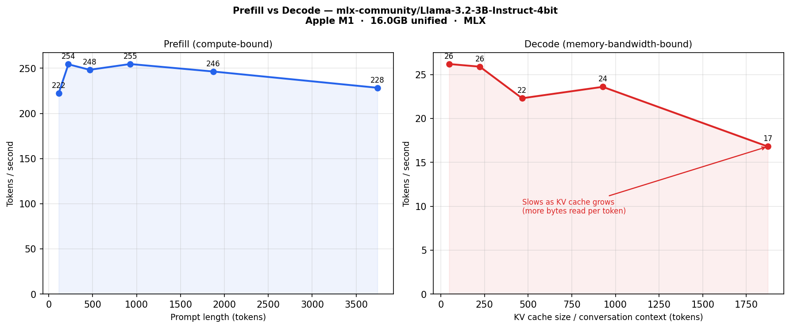

# Running Conversational AI Locally: A Systems View on Memory, Bandwidth, and Hardware Choices

If you've hit an out-of-memory error trying to run two models at once, or noticed your speech pipeline getting weirdly slow after a long conversation, you've probably started to suspect that TFLOPs, GPU cores, and synthetic benchmarks aren't telling you the right story.

This post is about what the right story actually is.

---

## Where This Comes From

Around 2018, the field was moving fast in directions that felt practical for the first time. Howard and Ruder had just dropped [ULMFiT](https://arxiv.org/abs/1801.06146), which made the case that pretrained language models could transfer usefully across tasks with fine-tuning — not just in theory but in practice, on real classification benchmarks. The key insight wasn't just the pretraining; it was the discriminative fine-tuning and gradual unfreezing that made transfer actually work without catastrophic forgetting — the tendency of neural networks to overwrite what they've already learned when you train them on something new. Around the same time, Merity et al.'s work on [AWD-LSTM](https://arxiv.org/abs/1708.02182) was showing what careful regularization could do for language modeling without scaling brute force. These weren't papers I read after the fact. They were shaping how I thought about what was worth building and what was worth running locally.

The transformer architecture that underpins all of this — Vaswani et al.'s [*Attention Is All You Need*](https://arxiv.org/abs/1706.03762) from 2017 — replaced recurrence with self-attention and made parallel processing over sequences tractable. If you've used any LLM in the last few years, you've used a transformer. What that paper didn't spend much time on was what happens at inference time when you're running these things under real constraints on a machine you actually own. That part you learn from the hardware.

The models I was running at that point were BERT, RoBERTa, Whisper, wav2vec, XTTS, and Kaldi pipelines. The hardware was a dual 1080 Ti — two cards, 11GB VRAM each, connected over PCIe. On paper, 22GB. In practice, two separate 11GB budgets that required constant management: which model lives on which card, what fits together, what spills, what breaks under concurrent load.

BERT and RoBERTa handled classification and understanding tasks. Whisper and wav2vec handled speech recognition — wav2vec 2.0 ([Baevski et al., 2020](https://arxiv.org/abs/2006.11477)) was particularly interesting because it showed you could learn powerful speech representations from unlabeled audio using contrastive learning, and fine-tune with very little labeled data. That had direct implications for how I was thinking about ASR pipeline design on constrained hardware. XTTS for synthesis. Kaldi pipelines alongside, which at the time still had practical advantages for streaming and latency despite being architecturally older.

None of these models are enormous individually. But they are additive. And on split VRAM over PCIe, every coexistence decision had a cost. The thing that took actually running them together to internalize: the problem isn't just whether models fit. It's whether they can all run at the same time without fighting each other for resources.

That setup taught me to think in memory budgets before anything else. Not because I chose to, but because the hardware forced it.

When those pipelines needed to scale, I moved them to cloud. That removed the capacity ceiling and let me focus on something different — how pipelines behave under real load, how latency characteristics change at scale, what breaks only when multiple users are hitting the system simultaneously. By this point, continuous batching was becoming the right way to think about serving. The Orca paper (Yu et al., OSDI 2022) introduced iteration-level scheduling — the insight that you don't need to wait for all requests in a batch to finish before accepting new ones. The HuggingFace writeup on [continuous batching](https://huggingface.co/blog/continuous_batching) explains clearly why the naive approach wastes GPU time: if you've got ten requests running and one finishes early, static batching makes it wait for the slowest one before the next batch starts. Continuous batching eliminates that dead time. vLLM took this further with PagedAttention, which manages the memory that stores the model's conversation context in non-contiguous blocks — the same idea as OS virtual memory, applied to the specific problem of conversation memory growing unpredictably. Cloud scale was where I saw firsthand what these optimizations actually do under sustained load.

Now I work primarily on a MacBook Pro M-series. The choice reflects something consistent throughout — working on personal projects and learning these systems on my own time, mobility has always mattered more than raw headroom. A desktop ties you to a room. A laptop means the experiments happen wherever you are, late at night, between other things, whenever the problem pulls at you. That's how most of this learning actually happened — not in a lab, not with institutional resources, but on whatever machine was in front of me.

The unified memory architecture in Apple Silicon makes that tradeoff far less painful than it used to be. What required constant placement decisions on the 1080 Ti is tractable on a MacBook Pro within a single machine you can carry. And the upgrade path is clear: M5 or M5 Pro MacBook Pro next, a Mac Studio with 128GB+ when the pipelines genuinely outgrow it.

This post is a systems-oriented view of how that accumulated experience, from 2018 to now, shapes how I think about hardware for this class of workload.

---

## The Workload: What's Actually Running

To make sense of the hardware decisions later, it helps to understand what a conversational AI system actually looks like at the component level — because it's not one model, it's several, running at the same time.

A minimal conversational pipeline:

```
Audio → ASR → LLM → TTS → Audio
```

Each arrow is a model. Audio comes in, a speech recognition model (ASR) transcribes it to text, a language model generates a response, a text-to-speech model converts that back to audio. In a real system, these don't run in neat sequence — ASR is streaming continuously while the LLM is generating, and TTS starts consuming LLM output before the LLM has finished. They overlap.

In more recent speech-to-speech architectures, the coupling is even tighter:

```
Speech Encoder → Reasoning Transformer → Speech Decoder
```

Here the speech decoder isn't just taking text from the language model — it's consuming the model's internal representations directly, which preserves prosodic information (rhythm, emphasis, tone) that gets lost when you convert to text first. Tighter coupling means better output quality but also means the components can't be reasoned about independently for memory or latency purposes.

I also run finetuning locally — taking the output from these inference sessions, curating it, and using it to train models to reflect how I actually think and work. That adds a separate set of memory requirements on top of inference, which I'll get to later.

The core point: hardware decisions for this kind of workload are about the whole system, not any individual model. Understanding aggregate behavior is what matters.

---

## Prefill and Decode: The Two Phases That Explain Everything

If there's one conceptual distinction that explains most of the hardware behavior I've encountered, it's this one. Every time a transformer model generates text, it operates in two distinct phases: prefill and decode. They're so different in their hardware demands that understanding them separately is the key to understanding why local inference behaves the way it does.

**Prefill** is what happens when the model first processes your input. If you send a 500-word prompt, the model reads all 500 words in parallel — it can do this because all the input is known upfront. This phase is compute-intensive: the GPU is doing a lot of arithmetic, utilization is high, and the bottleneck is processing power. It also builds the KV cache — think of this as the model's working memory for the conversation, storing information it'll need to reference while generating a response. The longer your input, the longer prefill takes. This is why chatbots with long system prompts feel slower to respond than ones with short prompts — the compute cost of reading your whole history is paid upfront, every turn.

**Decode** is what happens for every token after that first one. The model generates one word (token) at a time, and for each token it has to read all of its weights — billions of numbers — plus the entire accumulated KV cache. The actual arithmetic per token is relatively small. The problem is the sheer volume of data that has to move from memory to the processor to do even that small amount of arithmetic.

This is the critical insight: **decode is limited by how fast you can move data, not how fast you can compute.** The technical term is memory-bandwidth bound, and it means that in a long conversation — which is most of what conversational AI actually is — the speed of your memory bus matters more than the raw power of your processor.

This was true on the 1080 Ti. It is true on cloud A100s. It is true on Apple Silicon. The hardware changes; the constraint doesn't.

The TNG Technology Consulting team's [writeup on prefill and decode under concurrent requests](https://huggingface.co/blog/tngtech/llm-performance-prefill-decode-concurrent-requests) is one of the cleaner empirical demonstrations of this. Running production LLM infrastructure on 24 H100 GPUs — 5,000+ inferences per hour, over ten million tokens daily — they show token throughput scaling almost linearly with concurrency up to a point, then flattening sharply. That inflection point is exactly where the system transitions from memory-bandwidth bound to compute bound. It's not theoretical; it shows up in measurements as a clean behavioral shift. Their chunked prefill results are particularly instructive: by breaking prefill into smaller steps and interleaving them with decode steps, they increased total throughput by roughly 50%. The reason that works is exactly the prefill/decode framing — prefill is compute-intensive, decode is memory-bound, running both in parallel keeps different parts of the hardware busy simultaneously rather than serializing workloads that don't need to be.

This framing will inform everything that follows.

---

## How Much Memory Does This Actually Need?

Before you can reason about which hardware fits your use case, you need to understand what your use case actually costs in memory. The numbers here are estimates, but they're close enough for real decisions.

**The basic formula for model weight memory:**

```
Model memory ≈ parameters × bytes_per_weight
```

The precision of the weights determines bytes-per-weight. The common formats:

- FP16 (half precision): 2 bytes per weight — standard for GPU inference
- INT8: 1 byte per weight — reasonable quality, half the size
- INT4: 0.5 bytes per weight — fits more in less memory, some quality tradeoff

So a 7B parameter model at FP16 consumes about 14GB. At INT4, about 3.5GB. That's a 4x reduction, which is why quantization is such a big deal for local inference.

**The formula for conversation memory (KV cache):**

```
Total KV ≈ 2 × num_layers × hidden_size × sequence_length × bytes
```

For a 7B model (32 layers, hidden size 4096) at FP16, a 4096-token context adds roughly 2GB of KV cache. At 8192 tokens, roughly 4GB. This memory grows as the conversation gets longer and doesn't reset between turns — it accumulates. Which means a system that fits fine at the start of a conversation can start straining after 20–30 exchanges.

**The components in a moderate pipeline:**

| Component | Memory |
|-----------|--------|
| 7B LLM at INT4 (Q4_K_M) | ~3.5 GB |
| ASR — Whisper large-v3 at INT8 | ~1.5 GB |
| TTS — XTTS v2 at FP16 | ~1.5 GB |
| KV cache at 4K context | ~2 GB |
| OS + runtime + buffers | ~6 GB |
| **Total** | **~14–15 GB** |

Scale the LLM to 13B INT4 and it jumps to ~6.5GB for the LLM alone. Extend context to 8K and the KV cache doubles. Add a second ASR stream. Run background embedding indexing. The numbers compound quickly — and this is the lesson the dual 1080 Ti taught before anything else. You can't reason about each model in isolation. The system is additive.

**A note on quantization quality — because the memory number alone is misleading.**

INT4 at 3.5GB looks like an obvious win over FP16 at 14GB. But not all INT4 is equal. Naive INT4 applies the same precision reduction uniformly across all weights, and the errors accumulate — particularly on tasks requiring nuanced reasoning or long conversation coherence.

The k-quant variants (Q4_K_M, Q4_K_S, Q5_K_M) used by llama.cpp and MLX handle this more carefully. Weights that are more sensitive to error get higher precision; weights that tolerate error get lower. The result fits in the same memory footprint as naive INT4 but degrades much more gracefully.

For the speech pipeline specifically: Whisper handles INT8 well — acoustic features have enough redundancy that some precision loss is tolerable. TTS is more sensitive — INT4 vocoder artifacts become audible in ways INT8 mostly avoids. LLMs tolerate INT4 well for most conversation, but the tradeoff becomes apparent on complex reasoning tasks. Q4_K_M on a 7B or 13B model is a reasonable default for conversational use. For precise long-form reasoning, Q5_K_M or Q8 on a smaller model can outperform Q4 on a larger one.

**LLM sizes and formats, for reference:**

| Model | FP16 | INT8 | INT4 |
|-------|------|------|------|
| 7B    | ~14 GB | ~7 GB | ~3.5 GB |
| 13B   | ~26 GB | ~13 GB | ~6.5 GB |
| 14B   | ~28 GB | ~14 GB | ~7 GB |
| 70B   | ~140 GB | ~70 GB | ~35 GB |

The key question when looking at these numbers isn't just "does it fit." It's "does it fit at the quantization level where it's still useful for what I'm actually trying to do, with headroom for the KV cache to grow over a real session."

---

## What Breaks Under Concurrent Load

The memory accounting tells you whether things fit. This section tells you what happens when they're all running at the same time — which is a different problem, and the one that benchmarks almost never reveal.

**Bandwidth contention: the hidden performance floor**

ASR and LLM decode both need to read large amounts of data from memory continuously, and they share the same memory bus. When they run at the same time — which they always do in a conversational system — they compete for that bus.

The effect isn't that one crashes or fails. The effect is that both get slower in ways that are hard to predict from single-model benchmarks, because benchmarks never run both at once. What you see in a real pipeline is jitter — response times that should be consistent become inconsistent. The LLM generates more slowly on some turns than others, depending on where ASR is in its processing cycle. That irregularity flows downstream: TTS receives tokens at uneven intervals, and if your synthesis stack expects a steady stream, you get audible artifacts in the output.

On the 1080 Ti, this was the first thing that made single-model benchmarks feel irrelevant. Each model hit its rated throughput in isolation. Under concurrent load, the pipeline became unpredictable. The models were fine. The system wasn't.

You can partially work around this through scheduling — serializing parts of the pipeline, batching ASR into segments rather than streaming frame by frame. But every workaround trades one problem for another. Serialize ASR and you increase response latency. Batch ASR and you increase transcription lag. There's no free option. The only structural solution is enough memory bandwidth that the contention penalty becomes small relative to total available throughput. This is one of the core reasons higher-bandwidth chips matter for this workload — not because a single model runs faster, but because multiple models running simultaneously degrade less.

**KV cache growth over a session**

The KV cache accumulates with conversation length, and the effect compounds. At turn 5, the cache is small — decode is fast. At turn 40 of the same conversation, with long exchanges, the cache has grown substantially. The model is reading more data on every single token, which means slower decode, which means more time competing for the memory bus with ASR and TTS. A pipeline that felt snappy at the start of a session can feel noticeably sluggish by the end of a long one.

Testing on short sessions will not reveal this. If you're evaluating hardware for conversational use, test with realistic session lengths — 20, 30, 40 turns of actual conversational depth — not five-turn benchmarks. This was one of the things cloud scale made visible that the 1080 Ti couldn't easily demonstrate: production conversations are much longer than test conversations, and the degradation over time is real.

**Sustained thermal behavior**

A conversational speech pipeline has very short idle periods. ASR is running whenever the user is speaking. LLM is running whenever the system is responding. TTS is running in parallel. The machine is under continuous load in a way that batch inference never is.

Most hardware can hit peak numbers in a short burst. Sustaining those numbers over hours is different. Thermal throttling under sustained load doesn't announce itself — it shows up as gradually increasing latency that's easy to misattribute to software or model behavior. This is one of the real differences between a laptop running near its thermal ceiling and hardware designed for sustained continuous load. Understanding where that ceiling is matters more for speech workloads than for almost any other AI use case.

---

## Unified Memory vs Discrete VRAM: Why the Architecture Matters

This is the architectural difference that changed what's possible on a laptop, and it's worth understanding properly rather than just taking it on faith.

Traditional discrete GPU setups — the 1080 Ti included — maintain two physically separate memory pools. System RAM for the CPU, VRAM for the GPU, connected by PCIe. The hard rule: if your model doesn't fit in VRAM, it doesn't run on the GPU. If you split models across two GPUs, communication between them goes through PCIe at roughly 16 GB/s — fast in absolute terms, painfully slow compared to the ~1TB/s bandwidth inside a modern GPU's on-chip memory.

On the dual 1080 Ti, 22GB of total VRAM sounds like headroom. With BERT on card one and wav2vec plus XTTS on card two, you're at 8–10GB before the LLM loads. Any operation requiring data from a model on card one to be used by a model on card two goes through that PCIe bottleneck. This is why the setup felt slower under concurrent load than the individual benchmarks suggested — the bottleneck wasn't the models, it was the architecture forcing them to communicate through a slow channel.

Unified memory removes the pool boundary entirely. CPU and GPU share a single physical memory fabric. There's no explicit copy operation, no separate allocation budget, one address space for everything. BERT, Whisper, wav2vec, XTTS — everything coexists without card placement decisions.

**The bandwidth tradeoff.**

Unified memory solves capacity fragmentation. It doesn't solve bandwidth — and bandwidth is what decode throughput depends on.

| Hardware | Memory | Memory Bandwidth |
|----------|--------|-----------------|
| M3 Pro | 18–36 GB | ~150 GB/s |
| M4 Pro | 24–48 GB | ~273 GB/s |
| M3 Max (48GB+) | 48–128 GB | ~400 GB/s |
| DGX Spark (GB10) | 128 GB | ~273 GB/s |
| M2 Ultra / M3 Ultra | 128–192 GB | ~800 GB/s |
| RTX 4090 | 24 GB VRAM | ~1,008 GB/s |
| H100 SXM | 80 GB HBM3 | ~3,350 GB/s |

An M3 Max at 400 GB/s is about 40% of an RTX 4090's bandwidth. Against an H100, there's no comparison. For raw token generation speed on a single model, a high-bandwidth discrete GPU wins if the model fits in VRAM.

The DGX Spark is an instructive case: 128GB of unified LPDDR5x with a full Blackwell GPU and 1 PFLOP of FP4 tensor performance, but the same 273 GB/s bandwidth as the M4 Pro. It has the capacity of a Mac Studio Ultra and the compute of a datacenter chip, but for decode-dominated conversational workloads — where throughput tracks bandwidth, not compute — it will feel closer to an M4 Pro than to an Ultra. The massive compute helps prefill and finetuning; the bandwidth determines how fast tokens come out in a long conversation. Capacity and bandwidth are independent constraints, and the DGX Spark makes that independence visible.

The practical question is which constraint is actually binding for your workload. If your full working set fits comfortably in VRAM with headroom for KV cache growth, a high-bandwidth discrete GPU is faster. If it doesn't fit — or only fits under quantization that compromises quality — unified memory's larger effective capacity matters more than bandwidth ceiling.

For the conversational speech pipeline: a 7B + Whisper + XTTS stack at ~14–15GB fits in a 24GB discrete GPU, barely, with limited KV cache headroom. At 36GB or 48GB unified memory, it fits with room for longer sessions and a second concurrent process. The bandwidth is lower; the capacity headroom is what makes the pipeline actually stable.

---

## MLX: The Framework That Makes Apple Silicon Worth It

Running LLMs on Apple Silicon used to mean using frameworks designed for discrete GPUs — allocating memory twice, copying data back and forth, adding overhead that partly undermined the unified memory advantage.

[MLX](https://github.com/ml-explore/mlx) is Apple's native machine learning framework for Apple Silicon, designed from the ground up around unified memory. Tensors live in shared memory. Operations are dispatched to the appropriate compute units — CPU, GPU, Neural Engine — without explicit data transfers. The framework manages placement based on the computation graph rather than requiring you to manage it manually.

For local LLM inference, the practical difference is real. A Q4_K_M 7B model on an M3 Max achieves 40–70 tokens per second through mlx-lm depending on context length — fast enough for real conversational use. For Whisper inference, mlx-whisper handles streaming transcription natively with the same unified memory advantages. For finetuning, mlx-lm supports LoRA training directly on Apple Silicon, with no separate VRAM budget and no device copies.

The ecosystem has matured quickly: model conversions from Hugging Face formats to MLX-compatible formats are available for most major model families, the community is active and Apple Silicon-focused, and the tooling for loading quantized models, running chat inference, and fine-tuning with LoRA adapters is now genuinely practical rather than experimental.

MLX is not faster than a high-bandwidth discrete GPU for raw throughput. It's the framework that makes unified memory actually useful rather than partially wasted. For anyone running conversational AI on Apple Silicon, it's the right starting point.

---

## Speech-to-Speech: Where All the Constraints Compound

Speech-to-speech systems are the most demanding local configuration because they're the most concurrent and the most tightly coupled. Every stage is active simultaneously and the stages can't be cleanly decoupled.

A complete stack:

```
Audio → Acoustic Encoder → Reasoning Transformer → Speech Decoder → Vocoder → Audio
```

Footprint for a moderate configuration:

| Component | Memory |
|-----------|--------|
| Acoustic encoder (~1B, FP16) | ~2 GB |
| Reasoning core (7B INT4) | ~3.5 GB |
| Speech decoder (~1B, FP16) | ~2 GB |
| Vocoder (~500M, FP16) | ~1 GB |
| KV cache (4K context) | ~2 GB |
| Streaming buffers + activations | ~2–3 GB |
| OS + runtime | ~6 GB |
| **Total** | **~18–20 GB** |

Upgrade the reasoning core to 13B and you're at ~22–25GB before KV cache grows. That sits uncomfortably in a 24GB configuration and comfortably in 36GB or 48GB.

The bandwidth demand compounds here too. The acoustic encoder and speech decoder aren't idle between turns — they process audio continuously. The vocoder generates samples at real-time rate, holding the memory bus for a frame at a time without yielding. The reasoning transformer is decoding tokens to feed the speech decoder. All of these compete for the same memory bus simultaneously.

This is where speech-to-speech models represent a meaningful architectural shift. Rather than chaining separate ASR, LLM, and TTS models — each with its own weight footprint and memory allocation — speech-to-speech models like [Personaplex](https://personaplex.ai/) integrate audio encoding, reasoning, and speech decoding into a single end-to-end architecture. The input is audio and the output is audio, with no intermediate text representation. This matters for two reasons. First, shared internal representations across stages reduce the total weight footprint compared to loading three or four independent models. Second, because the speech decoder operates on the model's internal states rather than text tokens, the output preserves prosodic information — rhythm, emphasis, emotional tone — that a text-mediated pipeline discards by design.

For local hardware, the implications are concrete. A pipeline of separate models requires each one to fit independently and compete for the memory bus independently. A unified speech-to-speech model has a single weight footprint and a single inference path, which simplifies memory accounting and reduces bus contention. But the bandwidth demand during inference is still significant — the model is still large, the KV cache still grows with conversation length, and the compute-to-memory-read ratio during decode is still unfavorable. The architectural consolidation helps with capacity; it doesn't eliminate the bandwidth constraint.

This is where the gap between discrete GPU setups and unified memory is most visible. Running a speech-to-speech stack on split VRAM required constant placement decisions and accepted PCIe as a latency floor between components. On unified memory at 36GB+, the stack coexists in one address space. The bandwidth ceiling is still real — but it's a softer constraint than the hard split of separate memory pools.

---

## Local Finetuning: Closing the Loop Between Inference and Training

Inference is only half of the local workload. The other half — and in some ways the more interesting half — is finetuning.

The way I use local models isn't just to run them. I use them to reason — working through research questions, exploring ideas, having extended back-and-forth on topics I'm genuinely thinking about. That interaction data isn't wasted. It feeds back into training. The goal is a model that has internalized my reasoning patterns, my vocabulary, my preferred ways of breaking down a problem — not a generic instruction-following model, but one shaped incrementally by actual usage.

The loop: local inference generates raw data, that data gets curated (not everything is kept — only exchanges where the model responded the way I want to reinforce, or where my correction of it is itself informative), that curated data goes into training, the resulting model goes back into inference. Each iteration the model moves closer to reflecting how I actually think rather than how the pretraining distribution thinks.

This is closer in spirit to what ULMFiT was pointing at in 2018 — adapting a general pretrained model to a specific domain through targeted training — except the domain is a person's own reasoning and interests rather than a text corpus. The data collection is ongoing and the training is incremental.

**Why finetuning used to be out of reach locally**

Full finetuning of a 7B model requires storing not just the model weights (~14GB at FP16) but gradients and optimizer states for every parameter. With Adam — the standard optimizer — optimizer states add roughly 2x the model size in memory, because Adam tracks two running averages per parameter. A 7B model under full finetuning with Adam requires roughly 14GB (weights) + 28GB (optimizer states) + activation memory during the backward pass. That's 60–80GB before anything else loads. Not realistic on the 1080 Ti, not realistic on a MacBook Pro.

**LoRA: making finetuning fit**

Hu et al.'s [LoRA (2021)](https://arxiv.org/abs/2106.09685) changed the terms of this with a key observation: weight updates during finetuning have low intrinsic rank. The meaningful adaptation that happens when you fine-tune a model can be captured by much smaller matrices. LoRA freezes the pretrained weights and injects pairs of small low-rank matrices into each transformer layer. Only those small matrices get trained — for a 7B model at rank 16, roughly 4–40 million trainable parameters instead of 7 billion. The optimizer states track only those parameters. Training memory drops from 60–80GB to roughly 16–20GB total.

After training, the adapter matrices merge back into the base weights mathematically. The resulting model runs at exactly the same speed as the original — no inference overhead.

**QLoRA: getting it onto the hardware you actually have**

Dettmers et al.'s [QLoRA (2023)](https://arxiv.org/abs/2305.14314) took LoRA further by quantizing the frozen base model to 4-bit NormalFloat (NF4) during training while keeping the adapter matrices in full 16-bit precision. The forward pass dynamically dequantizes base weights to 16-bit for computation, then discards the dequantized values — recomputed on each pass rather than stored. This reduces the base model footprint during training to the same ~3.5GB used at inference.

A 7B QLoRA run lands at roughly 10–14GB depending on batch size and sequence length. A 13B QLoRA run at roughly 16–22GB. Both fit within 36GB unified memory with room to operate. Both become more comfortable at 48GB — particularly for training on longer sequences, because activation memory during the backward pass grows with sequence length, and research conversations tend to be long.

MLX supports LoRA training natively through mlx-lm. The training loop uses the same unified memory architecture as inference — no device copies, no separate VRAM budget — and the tooling for dataset preparation, adapter configuration, and training runs is mature enough to use without fighting the framework.

For larger runs — big datasets, longer training jobs, models above 13B — cloud is the right answer. The practical division of labor: collect and curate data locally, validate a quick training pass locally, push longer or larger runs to cloud. Each environment doing what it's suited for.

**How finetuning changes the hardware calculus**

Inference requires memory for the model, KV cache, and pipeline. Finetuning adds memory for activations and optimizer states during the backward pass.

At 7B QLoRA with sequences up to 2048 tokens, 36GB unified memory is comfortable. At 4096–8192 token sequences — which matter for training on long research conversations — activation memory grows and 36GB gets tight. 48GB is the more comfortable floor for serious long-sequence finetuning. For 13B QLoRA at longer sequences, or running inference in one process while training runs in another, 48GB starts to feel like the minimum rather than headroom.

This is one of the concrete reasons 48GB matters more than it might seem from the inference numbers alone.

---

## Choosing Your Local Setup

This is where the systems reasoning meets the actual conditions of your life and work. Rather than comparing specific chip models — which age quickly — the more durable approach is to evaluate any hardware against the four constraints that actually determine whether a conversational AI pipeline works.

**Constraint 1: Memory headroom**

Does your full working set — all models loaded simultaneously — fit in memory with room for the KV cache to grow over a realistic 30–40 turn session? The memory tables earlier give the static picture. The dynamic picture is what matters: a pipeline that fits at turn 5 may not fit at turn 40. Evaluate at the end of a long session, not the beginning.

At 32GB unified memory, a 7B Q4_K_M model plus Whisper plus TTS fits, but KV cache headroom is limited and a second concurrent process is tight. At 48GB, a 13B pipeline fits with room for extended sessions. At 128GB+, 70B models at INT4 become tractable with comfortable headroom for everything else.

**Constraint 2: Memory bandwidth**

Does the hardware have enough bandwidth for multi-model overlap without jitter? Decode throughput is directly proportional to bandwidth, and concurrent models divide that bandwidth between them. The bandwidth table in the unified memory section gives the raw numbers; what matters is how they translate to real decode performance as the KV cache grows.

This is measurable. I built [prefill-decode-bench](https://github.com/akashicMarga/prefill-decode-bench) to surface exactly this — the prefill vs decode characteristics on your specific hardware with your specific models. It auto-detects whether you're on Apple Silicon (MLX) or Nvidia (CUDA), sweeps across prompt lengths and KV cache sizes, and produces the numbers that actually matter for pipeline planning.

Here's what the output looks like on an Apple M1 with 16GB unified memory, running Llama-3.2-3B-Instruct-4bit through MLX:



The left panel shows prefill throughput staying relatively flat (~222–254 tok/s) across prompt lengths from 128 to 4096 tokens — compute-bound, as expected. The right panel shows decode throughput degrading from 26 tok/s at a small KV cache to 17 tok/s at 2048 tokens — a 35% degradation as the conversation grows. That degradation is the memory bandwidth constraint becoming visible.

On this M1 with 16GB, decode is already slow enough that a speech pipeline would feel the lag. On higher-bandwidth hardware — M3 Max, M4 Pro, Ultra configurations — the same curve exists but the starting point is higher and the degradation less steep. The tool lets you measure where your specific hardware sits on that curve, with your specific models, rather than relying on spec-sheet bandwidth numbers that don't account for real inference behavior.

The concurrency benchmark (`benchmark_concurrent.py`) goes further: it runs LLM decode and Whisper simultaneously and measures the contention penalty — how much each model slows down when sharing the bus. On the M1, that penalty is substantial. On higher-bandwidth chips, it compresses. Measuring it on your hardware tells you whether your pipeline will jitter under real use.

**Constraint 3: Finetuning capacity**

Is there enough memory for QLoRA finetuning at the sequence lengths that actually produce good training signal? Inference and finetuning have different memory profiles. A system that runs inference comfortably can still be too tight for training, because activation memory during the backward pass grows with sequence length.

At 36GB, 7B QLoRA is comfortable at moderate sequence lengths. At 48GB, 13B QLoRA at longer sequences becomes viable. Below 36GB, finetuning competes too directly with inference for the same memory budget.

**Constraint 4: Growth room**

Is there room for the pipeline to grow one model size — or one additional component — without a hardware change? If you're at 90% memory utilization today, the next model upgrade or pipeline addition forces a hardware change. Buying headroom upfront is cheaper than upgrading sooner than planned.

**Mapping constraints to tiers**

| Tier | What it handles |
|------|-----------------|
| **Portable (36–48GB unified)** | 7B–13B inference, full ASR+LLM+TTS pipeline, speech-to-speech, QLoRA finetuning up to 13B. The right tier for personal projects and iterative work where mobility matters. |
| **Desktop (128GB+ unified)** | 70B inference, multi-session concurrency, long-sequence finetuning on larger models, sustained workloads without thermal throttling. The tier you move to when the laptop's ceiling shows up consistently. |
| **Cloud (A100 / H100)** | Production serving, large training runs, models above 30B unquantized, unpredictable concurrent load. Not a more expensive version of local hardware — a different tool for a different problem. |

The sequencing matters. Start where the constraints are manageable for what you're actually building today. Move up when the work makes the case, not before. And measure your actual hardware rather than trusting spec sheets — [prefill-decode-bench](https://github.com/akashicMarga/prefill-decode-bench) exists for exactly that reason.

---

## Closing Perspective

LLM inference is governed by compute throughput, memory bandwidth, memory capacity, and sustained thermal behavior. Conversational systems compound all four simultaneously because they run multiple models under real-time latency requirements. Add finetuning and the memory requirements shift again — not just "does the pipeline fit" but "does it fit with room to train on what the pipeline produces."

The 2018 era was about understanding what these models could do at all — ULMFiT showing that transfer learning worked in practice, early BERT showing what scale could produce, the first wav2vec work showing that self-supervised speech representation was tractable. The 1080 Ti era was about learning the hardware constraints in their least forgiving form: split VRAM pools, PCIe overhead, models that competed for space and bandwidth in ways no benchmark predicted. The cloud era removed those constraints and introduced different ones — serving infrastructure, concurrency at scale, the batching and memory management optimizations that make large-scale deployment economically viable. The Apple Silicon era is about bringing a workable version of that back to a machine you can carry, with MLX as the framework that actually uses the architecture, and a hardware path — portable unified memory now, desktop-class when the work demands it — that keeps local experimentation viable as the pipelines grow.

The progression isn't about hardware getting better in some abstract sense. It's about the binding constraint shifting — from "does it fit" to "how do I schedule it" to "how do I serve it at scale" to "how do I bring the right subset of it back locally, and train on what it produces, without losing the lessons from each prior stage." Each era had a specific lesson. The hardware choices now reflect all of them.

Hardware selection, in this context, is a systems engineering decision built on accumulated experience with where things break. Not a marketing decision. Not a benchmark decision.

---

*Key references:*
- Howard & Ruder, [ULMFiT (2018)](https://arxiv.org/abs/1801.06146)
- Merity et al., [AWD-LSTM (2017)](https://arxiv.org/abs/1708.02182)
- Vaswani et al., [Attention Is All You Need (2017)](https://arxiv.org/abs/1706.03762)
- Baevski et al., [wav2vec 2.0 (2020)](https://arxiv.org/abs/2006.11477)
- Yu et al., Orca: A Distributed Serving System for Transformer-Based Generative Models (OSDI 2022)
- HuggingFace, [Continuous Batching explainer](https://huggingface.co/blog/continuous_batching)
- Kwon et al., [Efficient Memory Management for LLM Serving with PagedAttention (2023)](https://blog.vllm.ai/2023/06/20/vllm.html)
- Merkel, TNG Technology, [Prefill and Decode for Concurrent Requests (2025)](https://huggingface.co/blog/tngtech/llm-performance-prefill-decode-concurrent-requests)
- Apple, [MLX — Machine Learning Framework for Apple Silicon](https://github.com/ml-explore/mlx)
- Hu et al., [LoRA: Low-Rank Adaptation of Large Language Models (2021)](https://arxiv.org/abs/2106.09685)
- Dettmers et al., [QLoRA: Efficient Finetuning of Quantized LLMs (2023)](https://arxiv.org/abs/2305.14314)
- [Personaplex — Speech-to-Speech Conversational AI](https://personaplex.ai/)
- [prefill-decode-bench — Measure prefill and decode on your hardware](https://github.com/akashicMarga/prefill-decode-bench)
